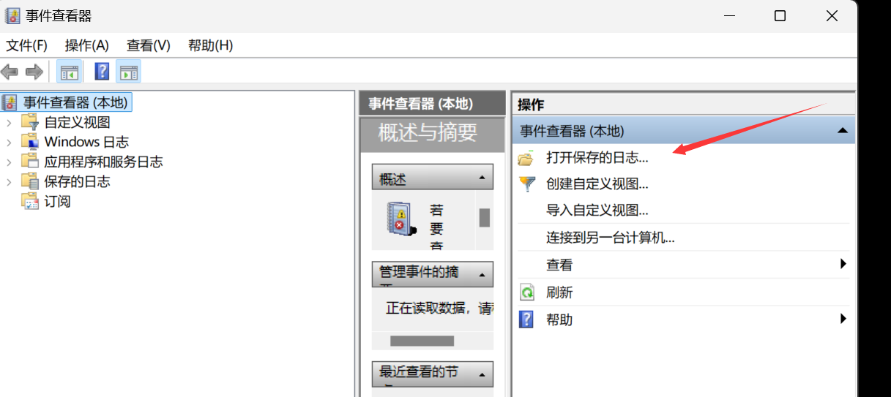
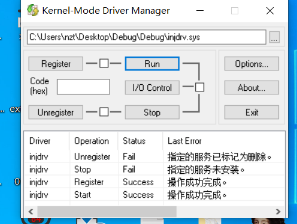
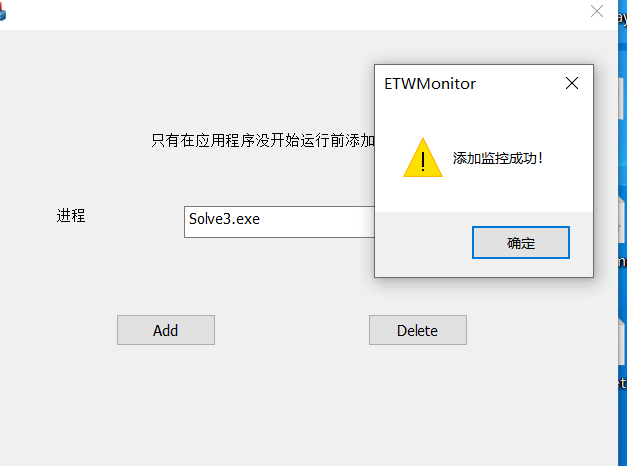
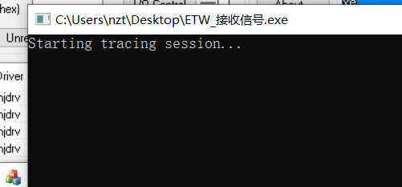
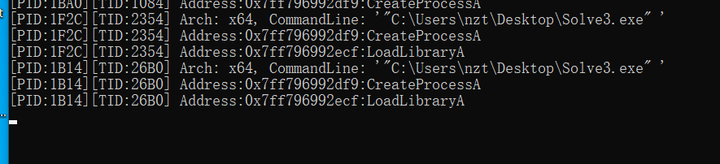
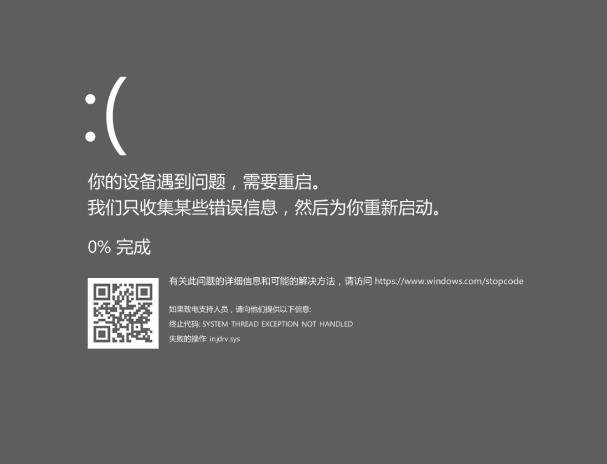

# 工具原理

该工具的大概原理描述下

用了内核级Dll注入，在程序加载完NTdll等必须Dll后，将我们的监控Dll注入，并进行断链，因为病毒大多只有三环权限，内核是接触不到的，在PEB是看不到我们注入的Dll的，所以这点来说会更加隐蔽

通过一个选择器，输入你要监控的程序名，如notepad.exe，那么数据就会被传输到内核驱动，从此之后，只要有名字叫notepad.exe的程序启动，都会被注入dll，当然也提供了取消监控的选项

监控Dll已经Hook掉一些敏感的API，例如LoadLibrary，CreatePrcess.....（模板有了后续可以自己加），这个Dll是一个ETW的Provider，注入这个Dll的程序都被分配到一个GUID，都会自动变成Provider，就可以写一个ETW接收器，接收来自被注入程序调用API的信息

监控的Dll除了可以像ETW输出调用的API名字之外，还可以输出调用来自具体哪个地址，方便溯源


# 优势

内核级注入，在三环不可见，因此病毒的一些常规反调试都会失效

用了ETW收集信息，可以把信息收集到一个etl文件，方便后续溯源




# 适用版本

我是按照WIN10 22H2的结构体偏移来写的，我不是很确定其他版本WIN10的其他版本，甚至更老WIN7或者更新的WIN11是否能够使用

并没有时间去适配其他版本，但是偏移可以在源码进行修正，原理都是一样的


# 如何使用？

首先在WIN10 22H2先加载上我们的驱动，因为是三无产品，所以要开测试模式




接着点开我们的监控程序添加删除程序，注意一定要管理员启动，例如我们这里添加一个叫Solve3.exe，然后点击确定




接着再打开ETW反馈信息接收器，记得要管理员启动，按下ctrl+c开始收集




如果遇到说ETW会话已经在运行，请手动关闭

```shell
C:\Windows\system32>logman stop myETWsession -ets
命令成功结束。
```


# 效果演试

先写一个最简单的，假设以下代码是一个病毒，并且加壳了，不好进行分析，但是相对流程进行梳理

可以看到下面调用了CreateProcess 和 LoadLibrary，比较敏感

```C++
#include <windows.h>
#include <iostream>

int main() {
    STARTUPINFOA si = { 0 };  // 初始化 STARTUPINFOA 结构
    PROCESS_INFORMATION pi = { 0 };  // 初始化 PROCESS_INFORMATION 结构

    si.cb = sizeof(STARTUPINFOA);  // 设置结构大小

    // 要创建的进程的路径
    const char* applicationName = "C:\\Windows\\System32\\notepad.exe";

    // 调用 CreateProcessA 函数
    BOOL success = CreateProcessA(
        applicationName,   // 应用程序路径
        NULL,              // 命令行参数（如果需要传递参数，可在此填写）
        NULL,              // 进程安全属性
        NULL,              // 线程安全属性
        FALSE,             // 是否继承句柄
        0,                 // 创建标志
        NULL,              // 环境变量（使用父进程环境）
        NULL,              // 工作目录（使用父进程工作目录）
        &si,               // 指向 STARTUPINFOA 结构的指针
        &pi                // 指向 PROCESS_INFORMATION 结构的指针
    );

    if (success) {
        std::cout << "Notepad.exe process created successfully!" << std::endl;
        std::cout << "Process ID: " << pi.dwProcessId << std::endl;

        // 等待进程结束（可选）
        WaitForSingleObject(pi.hProcess, INFINITE);

        // 关闭句柄
        CloseHandle(pi.hProcess);
        CloseHandle(pi.hThread);
    }
    else {
        std::cerr << "Failed to create process. Error code: " << GetLastError() << std::endl;
    }

    // 使用LoadLibraryA加载test.dll
    HMODULE hDll = LoadLibraryA("test.dll");
    system("pause");
    return 0;
}
```


然后我们看科这个工具的效果：




我启动了Solve3.exe两次，可以看到都捕捉到了API的调用，并列出了调用的地址，方便溯源，对于加壳的程序很有用（吧）


# 叠个甲

第一版，很拙劣，后续会继续优化可视化界面，目前测试蛮稳定的，终于不蓝屏了


但是我开发的时候没少蓝.......

